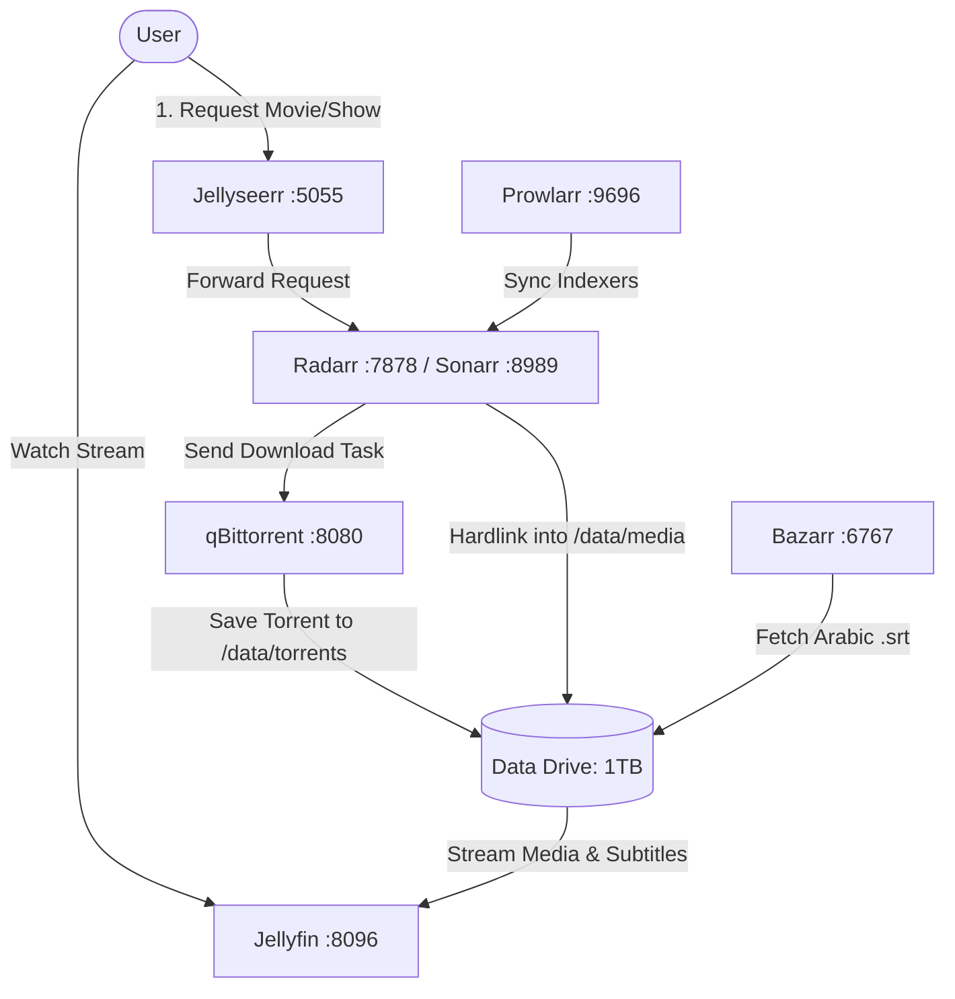

# My NetFelix 🎬🍿

An automated, self-hosted streaming and media management stack tailored for local network playback with Arabic subtitle support.

---

## Stack Components

| Service | Local URL | Description |
| :--- | :--- | :--- |
| **Homepage** | [http://192.168.1.15:3000](http://192.168.1.15:3000) | Single dashboard linking all services |
| **Watch Now** | [http://192.168.1.15:8090](http://192.168.1.15:8090) | Play videos while qBittorrent downloads them |
| **Jellyseerr** | [http://192.168.1.15:5055](http://192.168.1.15:5055) | Search & request movies and TV series |
| **Jellyfin** | [http://192.168.1.15:8096](http://192.168.1.15:8096) | Media server & video player |
| **Radarr** | [http://192.168.1.15:7878](http://192.168.1.15:7878) | Movie management & quality automation |
| **Sonarr** | [http://192.168.1.15:8989](http://192.168.1.15:8989) | TV series management & episode tracking |
| **Prowlarr** | [http://192.168.1.15:9696](http://192.168.1.15:9696) | Torrent indexer manager & sync agent |
| **qBittorrent** | [http://192.168.1.15:8080](http://192.168.1.15:8080) | Torrent download client |
| **Bazarr** | [http://192.168.1.15:6767](http://192.168.1.15:6767) | Automatic Arabic subtitle search & downloader |

---

## Architecture & Data Flow



---

## Hardware Optimization (Laptop Profile)

- **CPU/GPU**: Intel Core i7-4500U with Haswell HD 4400 Graphics.
- **Hardware Acceleration**: Intel VA-API (`/dev/dri`) is mounted for Jellyfin.
- **Transcoding Note**: Haswell hardware acceleration handles **H.264 up to 1080p**. It does *not* support hardware decoding for HEVC (H.265) or AV1. To prevent high CPU loads, prioritize **1080p H.264** in Radarr/Sonarr profiles for smooth Direct Play.
- **Storage Strategy**:
  - **Fast Configs & SQLite Databases** reside on internal SSD (`./config`).
  - **Bulk Media & Torrents** reside on external Data drive (`/media/dell/Data/netfelix_data`).
  - Single-mount layout (`/data`) enables instant zero-copy **hardlinks** between downloads and media libraries.

---

## Quick Start Guide

### Step 1: Install Docker & Docker Compose
Run the setup script (requires sudo password):
```bash
./setup_docker.sh
```

### Step 2: Start the Stack
On a fresh clone, create your local environment file and adjust its paths:
```bash
cp .env.example .env
```
Live service configuration, databases, credentials, and downloaded media are excluded from Git. Configure services using the walkthrough below on a fresh installation.

```bash
./netfelix.sh start
```

### Step 3: Useful Commands
- Check status: `./netfelix.sh status`
- View logs: `./netfelix.sh logs [service_name]` (e.g., `./netfelix.sh logs radarr`)
- Restart: `./netfelix.sh restart`
- Stop: `./netfelix.sh stop`
- Update containers: `./netfelix.sh update`

---

## Initial Service Setup Walkthrough

### 1. qBittorrent (`http://192.168.1.15:8080`)
- Pre-configured to allow local network login without credentials.
- Go to **Tools** > **Options** > **Downloads**:
  - Default Save Path: `/data/torrents/`
  - Keep incomplete torrents in: `/data/torrents/incomplete/`
- Go to **Speed**:
  - Under your laptop connection, limit global downloads to 1 or 2 at a time.

### 2. Prowlarr (`http://192.168.1.15:9696`)
- Go to **Indexers** > **Add Indexer**:
  - Add public sources (e.g., 1337x, EZTV, YTS, TorrentGalaxy).
- Go to **Settings** > **Apps** > **+**:
  - Add **Radarr**:
    - Prowlarr Server: `http://prowlarr:9696`
    - Radarr Server: `http://radarr:7878`
    - API Key: (Copy from Radarr > Settings > General > API Key)
  - Add **Sonarr**:
    - Sonarr Server: `http://sonarr:8989`
    - API Key: (Copy from Sonarr > Settings > General > API Key)
- Click **Sync App Indexers** to push indexers into Radarr & Sonarr automatically.

### 3. Radarr (`http://192.168.1.15:7878`) & Sonarr (`http://192.168.1.15:8989`)
- **Download Client**:
  - Go to **Settings** > **Download Clients** > **+** > **qBittorrent**:
    - Host: `qbittorrent`
    - Port: `8080`
    - Category: `movies` (for Radarr) or `tv` (for Sonarr)
- **Root Folder**:
  - In Radarr: `/data/media/movies`
  - In Sonarr: `/data/media/tv`
- **Quality Profile**:
  - Select or edit the profile to prioritize **1080p** releases.

### 4. Bazarr (`http://192.168.1.15:6767`) - Arabic Subtitles
- Go to **Settings** > **Radarr**:
  - Host: `radarr`, Port: `7878`, API Key from Radarr.
- Go to **Settings** > **Sonarr**:
  - Host: `sonarr`, Port: `8989`, API Key from Sonarr.
- Go to **Settings** > **Languages**:
  - Default Subtitle Language: **Arabic** (`ar`).
  - Enable *Hearing Impaired* fallback if desired.
- Go to **Settings** > **Providers**:
  - Enable providers with strong Arabic support (e.g., Subscene, OpenSubtitles.com, Podnapisi).

### 5. Jellyfin (`http://192.168.1.15:8096`)
- Complete the initial user wizard.
- Add Libraries:
  - **Movies**: `/data/media/movies`
  - **Shows**: `/data/media/tv`
- Go to **Admin Dashboard** > **Playback** > **Transcoding**:
  - Hardware acceleration: Select **Intel QuickSync (QSV)** or **Video Acceleration API (VAAPI)**.
  - VA API Device: `/dev/dri/renderD128`.
  - Enable hardware decoding only for **H.264** and **VC1**. Leave HEVC unchecked to avoid hardware errors on Haswell.

### 6. Jellyseerr (`http://192.168.1.15:5055`)
- Select **Jellyfin** as your media server.
  - Jellyfin URL: `http://jellyfin:8096`
  - Sign in with your Jellyfin credentials.
- In Jellyseerr Settings:
  - Connect **Radarr**: Server `http://radarr:7878`, paste API Key, select Root folder `/data/media/movies` and quality profile.
  - Connect **Sonarr**: Server `http://sonarr:8989`, paste API Key, select Root folder `/data/media/tv` and quality profile.

## Watch while downloading

1. Request a movie or show in Jellyseerr as usual. Once qBittorrent has its metadata, open **Watch Now** at `http://YOUR_SERVER_IP:8090` (also linked from the local Homepage).
2. Select the movie or episode and click **Watch now**. This enables sequential downloading, first/last-piece priority, and high priority for the selected file. It also resumes the selected torrent; other downloads are not stopped.
3. Playback begins once the first 16 MiB and the file's final piece are verified and the file exists on disk. The rest continues downloading through qBittorrent. The page reports buffer size, download speed, and download state.
4. If the browser cannot play the codecs/container, choose **Open playlist in VLC**, or copy the stream URL into VLC's **Open Network Stream**. Completed downloads still follow the existing Radarr/Sonarr → Jellyfin import workflow.

The service checks downloaded pieces before sending bytes, including HTTP byte-range requests. It never treats preallocated file size as proof that video data has downloaded. If playback catches up to the download, it waits; a request times out after 120 seconds without usable data. Retry playback after more data downloads. Seeking ahead does not reprioritize individual pieces and may take a while. Download speed and available peers still determine whether playback can remain smooth.

This first version supports **v1 torrents without padding files**. It rejects v2/hybrid torrents instead of guessing their piece offsets. Browser codec support varies; no transcoding or automatic subtitle integration is provided on Watch Now. Use Jellyfin for its normal library, transcoding, and subtitle features once the import completes. The streaming service is intended for your trusted LAN and has no separate login; do not expose port 8090 to the internet.

### Running and troubleshooting

- `./netfelix.sh start` builds Watch Now and starts the stack. This setup uses Linux host networking to reach qBittorrent at `127.0.0.1:8080` and listens on port `8090`.
- The script finds the drive using `/dev/disk/by-label/Data`, mounts it if necessary, and uses its actual mount point, including `Data1`. It refuses to start when that drive or its `netfelix_data/torrents` folder is missing. Override the device when needed: `MEDIA_DEVICE=/dev/disk/by-uuid/YOUR_UUID ./netfelix.sh start`.
- For direct `docker compose` commands, mount the drive first and set `.env`'s `MEDIA_ROOT` to its real `netfelix_data` path. Existing containers must be recreated after changing bind-mount paths.
- The current qBittorrent installation already permits localhost access. On a fresh installation that requires login, set `QBT_USERNAME` and `QBT_PASSWORD` in your ignored `.env`; restart Watch Now. Do not commit these credentials.
- Watch Now mounts torrent data read-only. Its API only prepares existing video downloads; add titles through Jellyseerr/qBittorrent.
- Inspect logs with `docker compose logs --tail=100 watch-now`.
- Run the verification suite with `python3 -m unittest discover -s streaming/tests -v`.

API behavior follows the [official qBittorrent Web API documentation](https://github.com/qbittorrent/qBittorrent/wiki/WebUI-API-%28qBittorrent-5.0%29).
